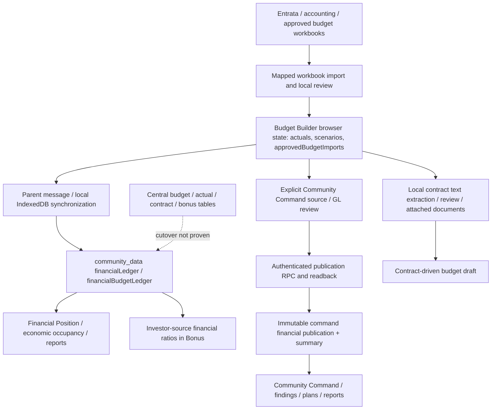

# Budget Builder governance and navigation review

Reviewed September 21, 2026, from main `c512a752`, on `feature/budget-governance-review`. This is a review and safe UI/correctness phase, not a completed central-ledger migration. No financial records, permissions, bonus formulas or database schemas were changed. Owner decisions listed below are required before those changes.

## Current-state lineage

### Verified implementation evidence

- `RISE-Budget-Builder.html`: 27 destinations; GL/month engine, local approval/lock state, variance review, save/restore, scenarios, workbook readers, contract text extraction and draft schedules. Approximately 1.88 MB, still predominantly inline. The approved budget seed is preserved.
- `budget-mapped-import.js`: approved import version precedence, explicit period coverage, workbook source metadata and approved-scenario engine override. Automatically synchronizes approved imports through a parent message.
- `financial-publication.js`: updates period-keyed browser community records, has a same-origin parent route and an IndexedDB fallback. Transaction completion alone previously returned `{ok:true}` without proving shared canonical readback.
- `atlas-mounts.js`: Budget Builder messages update community ledger maps, queue browser persistence and can synchronize shared graph metadata. This is not acknowledged normalized finance publication.
- `index.html`: monthly ledger consumers read the above maps. `atlasBonusMetricActual` reads investor-source NOI/expense ratios; a selected month/current calendar year is not proof of plan-specific closed-period eligibility.
- `features/budget-command-publication.mjs`: explicit reviewed RPC publication, exact community/period, source evidence, locked baseline, coverage review and readback. `fiscal-ytd.mjs` reconciles cross-year month evidence. This is a governed summary publication path, not an accounting close ledger.
- `centralization/atlas-central-schema.sql`: existing `atlas_budget_lines`, `atlas_actual_lines`, `atlas_contracts`, bonus periods/runs/lines and generic financial access policies. Budget/actual period indexes exist. Actuals lack close/reopen/reconciliation fields; budgets lack first-class scenario/vintage separation. Amounts are non-null with default zero. No immutable-close triggers were found on these three live tables.
- Read-only production counts: budget lines 0; actual lines 0; contracts 0; bonus calculation runs 0; command financial publications 0. Existing approved browser financial data has NOT been inferred absent or erased. These counts concern only the listed central tables.
- RLS is enabled. Actual/budget writes allow existing admin/finance scope. Contract writes additionally allow maintenance. These existing policies are evidence of current behavior, not the owner-approved future review/close matrix.
- Contract extraction exists: regex/text-based proposals, document retention, cadence, escalators and draft schedule. It lacks verified per-field page/confidence lineage and governed canonical term approval/alert delivery. Missing vendor/service/GL/dates can be defaulted; this is a critical risk, not proof of valid source terms.
- Issue #9 is open. Its required source-to-economic-occupancy/Financial Position and independent-session lineage evidence remains outstanding. Issue #12 also remains open.

## Gap and risk register

| Priority | Confirmed gap / risk | Required correction | Migration risk |
|---|---|---|---|
| Critical | Browser success mistaken for shared publication | Separate local synchronization from acknowledged publication; server receipt plus caller readback | Medium: existing callers rely on `ok` |
| Critical | Legacy actual/month publication coerces missing values to zero and includes unclosed months | Preserve null/zero/negative; limit exported actual periods; canonical close gate remains server work | Medium: reconcile every consumer |
| Critical | Original budgets and closed actuals not immutable first-class server versions | Version headers, immutable line sets, authorized transitions; retain original baseline | High: owner decisions and shadow reconciliation first |
| Critical | Bonus financial ratios lack complete approved-close eligibility lineage | Server-calculated eligible input snapshots and plan-specific payout gates | High: payroll reconciliation required |
| Critical | Contract guesses can become dates/GL assumptions | Store proposals separately, preserve unknowns, require field review and approved schedules | High if existing forecasts assumed guesses |
| High | Central finance tables empty while browser ledgers drive consumers | Inventory sources, dry-run staging, exact reconciliation and deliberate cutover | High: no automatic authority promotion |
| High | Summary publication and ledger publication have different authority | One publication manifest with consumer acknowledgments and source version IDs | Medium |
| High | Reforecast/revision/commitment/adjustment types not governed centrally | Isolated version types with explicit baseline references | High: depends on rules |
| High | Reopen cannot reliably invalidate downstream payable calculations | Dependency invalidation and superseded report/run status, retain immutable historical results | High |
| High | Monolith, inline parser/report/contract engines | Extract at workflow boundaries; workers, cancellation, disposal | Medium: existing public API compatibility |
| Medium | 27 permanently visible destinations | Seven workflows, contextual tools, search, breadcrumbs, stable context | Low: retain existing routers |
| Medium | GL detail throws undefined helper error | Expose existing source renderer through `R.contracts` | Low |
| Unknown | Production concurrency, representative finance volumes and report-delivery success | Two authorized users, real approved sources, measured current/future-scale tests | Not accepted yet |

No percentage performance improvement is claimed from navigation screenshots. Server query benchmarks are not meaningful on the currently empty finance tables. Measure shadow data at actual and projected volume before indexes/partitions are finalized.

## Proposed canonical data contract (decision-dependent)

Retain canonical community IDs, users, access assignments and existing finance tables where compatible. Add version/close/import relations; do not introduce a second competing financial ledger. The accompanying JSON document specifies fields and invariants; it is NOT a deployed migration.

- **Source/import**: immutable file object, SHA-256, exact source system/report identity, external source IDs, uploader, received timestamp, parser/mapping versions, declared community/period/basis/currency, raw and normalized row counts, rejected/quarantined records. Unique logical idempotency key includes community, source hash, report type, period and mapping version. A remap is a new reviewed import, never a silent replay.
- **Account mapping**: canonical account ID/code, name, parent, hierarchy version, income/expense/contra classification, debit/credit polarity, NOI/capital/intercompany/controllable flags, effective dates, approval metadata. Do not guess GLs. GL 5120 is already owner-confirmed for GPR; expense/bonus classifications still need approval.
- **Financial version**: community, calendar period(s), fiscal-calendar version and fiscal period, type (original budget, approved revision, actual close, reforecast, commitment, adjustment), scenario, immutable version ID, baseline version, effective date, responsible actors and transition timestamps. Preserve both original and latest approved versions; which controls reporting awaits owner choice.
- **Financial line grain**: one community × calendar month × GL × financial version × currency × accounting basis. Decimal amounts, never floating-point payroll amounts. Missing coverage is absence/null with an explicit reason; zero is a populated amount. Staging accepts missing values; approval requires complete required scope. Unique source-row identity prevents duplicates. Adjustments require source journal/reference and a link to the affected close.
- **Close certificate**: exact imported/stored totals by approved account class, report/trial-balance controls, debit/credit sign checks, rounding tolerances, unmapped/ambiguous exceptions and their resolutions, preparer/reviewer/closer, immutable source and mapping hashes, close timestamp and version. Trial balance rules must depend on the selected report type; never assume every income statement should sum to zero.
- **Publication**: immutable version manifest/fingerprint, authorized publisher, committed timestamp, receipt ID, readback hash, scoped consumer acknowledgment/status, retries and error. Local save, queued transfer, committed, readback verified, and consumer unavailable are distinct. A cache cannot declare the server close approved.
- **Contract terms**: document hash/storage reference, legal entity, vendor, authorized community scope, proposed field value, evidence page/range, extraction engine/version, confidence, human review and approved term version. Effective obligations and escalators expand into monthly commitments without overwriting actuals or original budgets. Unknown dates/amounts stay unknown; evergreen terms require an explicit reviewed form, not invented end dates.
- **Bonus run**: employee assignment and eligibility version, plan/formula version, period and financial close IDs, target budget IDs, GL/rollup definition version, numerator/denominator, attained value, rounding rule, payout and run fingerprint. Reopened/unapproved/missing/stale/unreconciled required inputs block payable status. Preserve the old run and produce a new run after corrections.

### Server transition model

Imports: received → staged → needs mapping / exceptions → reconciled → reviewed. Versions: draft → reviewed → approved → locked/closed → published. Reforecast approval and active designation are separate events. Reopening records an authorized reason and superseding transition, invalidates eligibility/freshness, and preserves old close/report snapshots. Whether correction means journal adjustments or replacement closes is unresolved.

Use authenticated RPCs with explicit server community/action permission checks, expected-version compare-and-swap, transaction-scoped locks for approval/close/publication, and revoked generic mutations of locked content. RLS remains on all exposed relations. Security-definer functions require narrow grants, checked user/scope and fixed search path. Views must preserve caller scope. No frontend service key. Hashes and readback are retained.

## Revised information architecture and screens

| Primary workflow | Existing contextual destinations |
|---|---|
| Overview | Dashboard |
| Budget Plan | Property budget, New budget, Monthly view, GL detail, Budget review, Occupancy schedule, Driver conversion, STR builder/programmes/segments/comparison |
| Actuals & Close | Actuals, Financial review, Budget vs actual, Exceptions, Commentary |
| Forecast | Scenarios, Assumptions, Recommendations |
| Contracts | Contracts, Utility providers |
| Reports | Reports/printing, Visuals, Export center |
| Setup & Imports | Imports, Save/restore |

The implemented navigation uses existing views and calculations; there is no separate prototype. Search is keyboard-accessible (Ctrl/Command K), routes retain hashes, and Continue returns to the prior tool. Context distinguishes local approval/lock, local close marker, browser save, and unverified shared ledger status. It does not invent a successful close or publication. Existing property/year/scenario controls remain.

Before/after screenshots are captured from the actual application on the review branch, not mock data substituted for the original budget. Existing imported/seed financial amounts are unchanged. Responsive secondary navigation scrolls horizontally. Full per-workflow guided progress, frozen GL/total columns and role-specific close actions await the governed integration; they are not represented as completed.

Future guided steps:

1. Annual budget: choose source/baseline → confirm calendar and accounts → use closed actuals/contracts/seasonality → edit explainable suggestions → resolve checks → review/approve/lock → publish/readback.
2. Month close: upload → identify scope/basis → map → validate signs and duplicates → reconcile controls → resolve exceptions → review/approve/close → publish/certify.
3. Reforecast: approved baseline → latest closed actual cutoff → approved contract/assumption changes → version comparison → approve vintage → designate active forecast → publish.

## Downstream contract and dependency plan

Every consumer receives the same scoped envelope: community ID, calendar/fiscal period, basis, currency, budget version/type, actual close/version/status, effective/as-of timestamps, coverage and source/GL lineage, publication fingerprint, stale/reopened flag and exact drill-down route. Request summary in one bounded community/period query; fetch GL causes only on drill-down.

Home/Community Command/Financial Review use the approved envelope. Findings distinguish data readiness from performance, deduplicate by source/target version and community-period-metric, and remain suggestions until owner decision. Existing shared plans/manual tasks/history/report snapshots are reused. Reports freeze their source version; exports/email use that same snapshot. Bonus additionally requires eligible close/assignment/plan gates. Scout receives authorized governed summaries and must cite their source versions, not infer actuals from a budget.

Implementation dependencies:

1. Owner decisions and reviewed source inventory; preserve current main and immutable backups.
2. Additive version/import/close/mapping contract; migration dry-run and RLS/concurrency tests. No production cutover.
3. Worker-backed intake with idempotency, staging exceptions, sign/basis validation and reconciliation certificate.
4. Budget approval, monthly close/reopen/adjustment and reforecast-vintage transitions.
5. Contract proposal/review/evidence, approved commitment expansion and deduplicated configurable alert delivery.
6. Scoped summary/outbox publication with readback and downstream adapters; dual-read reconciliation against existing ledgers.
7. Bonus eligible-input adapter and payout reconciliation; activate only after plan owners sign off.
8. Guided UI and exact drill-downs across all consumers; lazy feature separation and background processing.
9. Production-like source-to-export evidence, two-user tests, performance budgets; staged rollout. Keep issues #9/#12 open until their acceptance requirements pass.

## Owner decision register — unresolved

1. Official month-close accounting report/export and accounting basis.
2. Review, close, reopen, approve and publish role/user matrix, including segregation of duties.
3. Fiscal calendar per community, effective changes and fiscal-year naming.
4. Journal-style adjustments versus replacement close versions; closed-period correction rules.
5. Original versus revised approved baseline for each report and performance metric.
6. Payable metric definitions and approved account classifications for each bonus plan.
7. Monthly/quarterly/annual/contract-based bonus periods and rounding/eligibility rules.
8. Authoritative contract formats, folders and document versions.
9. Contract-term and escalation approvers.
10. Alert intervals, recipients, timezone and acknowledgment/escalation rules.
11. Suggested actions requiring acceptance versus automatic drafts.
12. Leadership/investor GL-detail permissions by report/audience.
13. Absolute/relative/materiality thresholds and task/escalation rules.
14. Forecast approvers and active-vintage designation authority.
15. Intercompany/capital/below-NOI/noncontrollable treatment in financial and bonus measures.

Questions were sent during the audit; no answers have been assumed. Existing access policies are not substituted for these business decisions.

## Validation, reconciliation and release gates

Completed locally: 61 test files passed after the GL-scope correction. All 27 destinations then rendered without errors in Chrome, with seven primary navigation items and unchanged financial state. Navigation browser checks compare financial state before/after all destinations. Automated publication fixtures preserve missing, blank, zero, negative values and exclude unclosed actual periods. Existing real approved budget fixture tests retain annual/monthly totals, mapping/version precedence and actual/budget isolation.

Not completed: a real approved value traversing canonical finance close storage, every downstream consumer, payable Bonus and exported reporting; two independent authorized users; contract field extraction confidence/alerts; production performance; confirmed report email. Empty central tables are not production reconciliation proof. No new central ledger migration was applied.

Acceptance evidence must include source hash/row/GL, mapping version, imported/stored control totals, certificate/version/close IDs, authorized independent-session readback, consumer values and source labels, bonus run/eligibility/payout totals, immutable report/export/email hashes and delivery receipt. Exercise missing/zero/negative/formatted rows, duplicate files/rows, wrong community/year/basis, reopening, stale requests, concurrent approvals, permissions and full history. Use small and large real authorized communities plus 2×/5× projected fixtures.

Rollout: review this branch; approve business decisions; run additive schema/staging work in an isolated environment; shadow-reconcile; enable one reviewed community/period; confirm two-user lineage; expand gradually. Deployment alone never closes #9/#12.

Rollback: revert UI/adapter assets to the recorded main; disable new publication/close actions while retaining read-only immutable records. Preserve all original source files, versions, certificates, audit events and delivery claims. Do not restore by overwriting approved history or dropping central tables. The current UI-only phase needs no database rollback.
