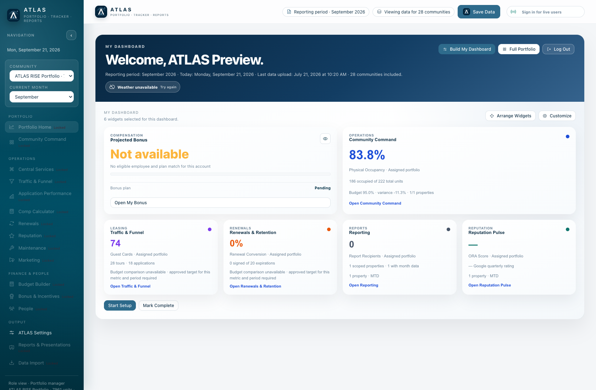
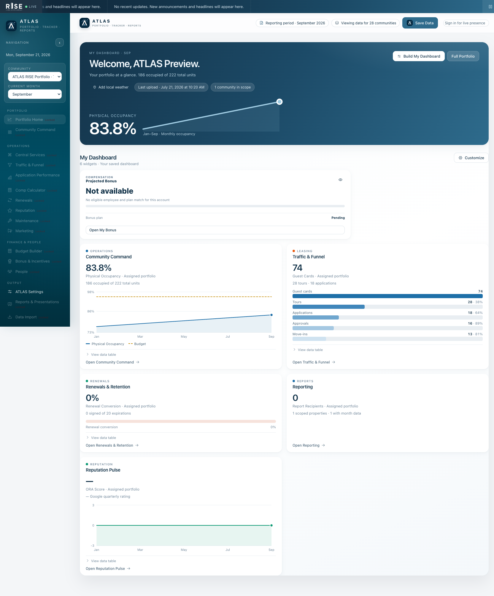
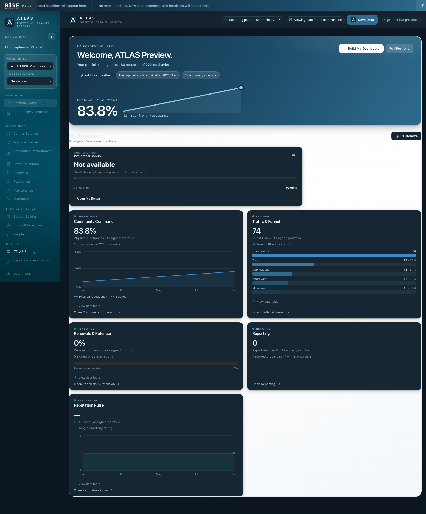
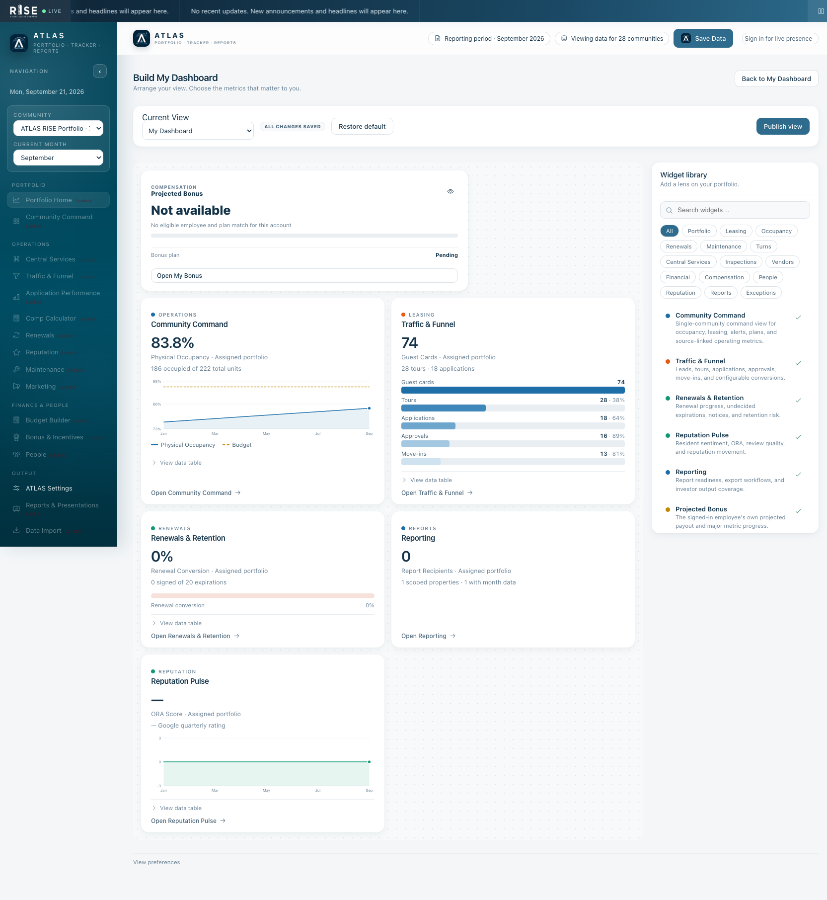
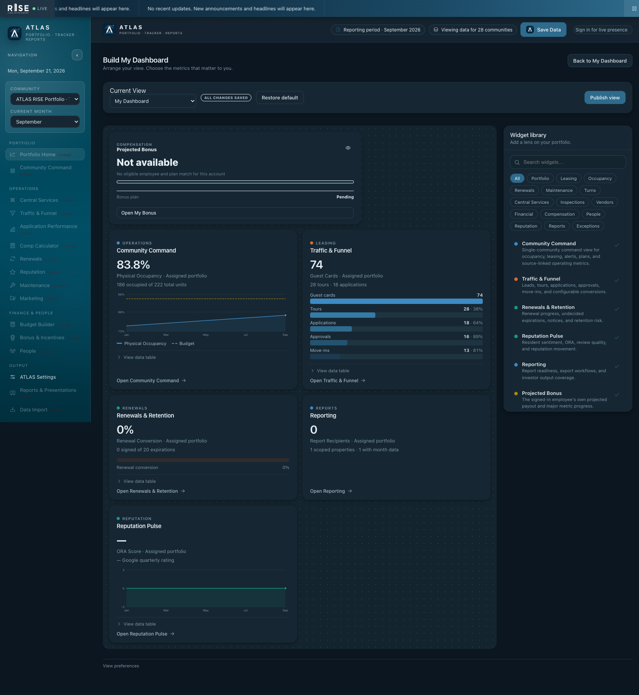

# ATLAS dashboard reskin verification

The landing view and dashboard customization use the supplied prototype palette, hero, chart cards, and canvas/library builder. The existing catalog, authorization, data calculations, view persistence, drag handling, and personal bonus privacy controls remain the source of truth.

The supplied ticker-services patch was applied unchanged. `test-ticker.mjs` now exercises the ticker block extracted from the actual production Worker rather than a duplicate service file. Deployment runs the lifecycle and presentation tests.

## Checks

- Ticker lifecycle: **43 passed, 0 failed**.
- All **51** test programs referenced by the existing workflows, plus the new ticker/presentation programs, pass locally (the workbook fixture dependency is installed locally as in CI).
- Browser: landing and builder at 1680, 1280, and 900 pixels; no horizontal overflow. Light/dark rendering, widget search with retained focus, category filters, move controls, drag/drop handler integration, local Publish returning to Home, one hero figure, expandable data tables, and chart tooltips checked.
- UI tests cover author/admin editing, read-only non-author regional access, preserved expiry on edit, expired announcement filtering, unauthorized activity exclusion, unsafe-link rejection, and content escaping.
- Screenshots use isolated local sample records labelled **ATLAS Preview**, not a production login or a representation of current portfolio metrics.
- Authenticated two-browser announcement propagation was not exercised: no signed-in production test sessions were available. The server permission/lifecycle tests and mocked client integration passed. No test announcements were broadcast to users.
- The initial backend preview version uploaded successfully (`05600cbd-703c-4598-bd4e-08cf26f7e823`); Cloudflare did not provide an accessible preview URL.

## Implementation decisions

- Preserve the current personal bonus card's privacy toggle, identity filtering, and calculation safeguards, with scoped presentation updates.
- Keep Phase 2 widgets disabled until their real data integrations are available. Do not port prototype sample financial or maintenance figures into production.
- Keep account/access/platform settings available in a disclosure below the builder.
- Add guarded zero/single-point handling to the prototype chart helpers and remove clipped labels; use the existing data/table fallback when history is unavailable.
- Audit records do not consistently include a human author. Display the recorded source when an author is absent; never invent a user.
- Use a native modal dialog for focus containment, Escape dismissal, and read-only announcement viewing.
- Follow the user's explicit instruction to publish live, superseding the attachment's review-only handoff instruction.

## Visual review

### Before

### Landing

### Customization

